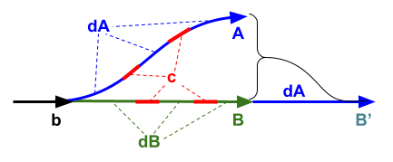

Git Workflows
===

Typical workflows
---

- [Centralized Workflow](https://www.atlassian.com/git/tutorials/comparing-workflows) with **linear history**: 
  This is the old workflow from Subversion (SVN) based on a single central branch, usually named `main` or `master` or `trunk`. The linearity is usually achieved with `git rebase`: the downstream (branch or local repo) is rebased to the upstream's `HEAD` before being fast-forward-merged into the upstream. Instead of `rebase`, `merge --squash` can also be used to linearize the history when downstream is merged into upstream.
- [Branching workflows](https://www.abtasty.com/blog/git-branching-strategies/) for features, commons, release and deployment:
  Git is superior at branching and merging. Hence, most of the Git workflows are based on `git branch` and `git merge`.    
  
  + [Feature Branch Workflow](https://www.atlassian.com/git/tutorials/comparing-workflows/feature-branch-workflow):
    For each feature, functionality, or task, a "feature branch" is forked from the main branch. The dev in charge will commit changes to his/her feature branch, then request the main branch to pull & merge these commits via [pull requests](https://docs.github.com/en/pull-requests) (PR), which is also called ["merge requests"](https://docs.gitlab.com/ee/user/project/merge_requests/) (MR).
    + In 2-layer branching, the main branch is usually named `main`, `master` or `trunk`.
    + In multilayered branching, each feature branch can be the main branch for the next layer of branching , e.g. `master` -> `project` -> `feature`, or `master` -> [`integration`](https://remarkablemark.medium.com/git-integration-branch-workflow-77fa0fd32883) -> `ticket`, etc.
  + [Common Branch Workflow](#CommonBranchWorkflow):
    This extends the Feature Branch Workflow with one (or more) common branch holding common commits to be shared with other feature branches.
  + [Forking Workflow](https://www.atlassian.com/git/tutorials/comparing-workflows/forking-workflow):
    This extends the branching from branches to repositories. Instead of forking feature branches from the main branch, here each dev will fork a downstream repo from the upstream repo. The dev will commit changes to downstream repo, then request the upstream repo to pull & merge these commits via PR/MR. This workflow enpowers the *open-source development*.
  + [Git Flow](https://nvie.com/posts/a-successful-git-branching-model/): 
    This extends the Feature Branch Workflow with *release* and *hotfix* branches for scheduled release management.
  + [GitLab Flow](https://docs.gitlab.co.jp/ee/topics/gitlab_flow.html#production-branch-with-gitlab-flow): 
    This adds branches for *deployment on different environments*, e.g. staging, pre-production, production. 
- [Trunk-based workflows](https://www.atlassian.com/continuous-delivery/continuous-integration/trunk-based-development) for CI/CD:
  The modern frameworks for continuous integration & continuous deployment (CI/CD) enable devs to get back to the simple Centralized Workflow. There may also be feature branches, like in [GitHub Flow](https://docs.github.com/en/get-started/using-github/github-flow), but they are **short-lived** instead of long-lived feature branches in the Feature Branch Workflow.

<a id="CommonBranchWorkflow" name="CommonBranchWorkflow"/>

Common Branch Workflow
---

Although most of the feature branches (in Feature Branch Workflow) are independent of each other, sometime there are common features must be shared between other features. In this case, instead of pushing all shared commits to the main branch, we should have a common branch managing these common features.

Workflow:
- The common branch is treated as a feature branch:
  + It's forked from the main branch then eventually merged back to the main branch. However, the common branch must be ***merged first**, before all other feature branches*.
  + In developing phase, it holds **works in progress** (WIPs) which usually have backward changes and rollbacks. However, these WIPs should be reviewed.
  + Before being merged into the main branch, the common branch can be cleaned up, beautified with squashing, rebased, etc.
  + Note: Other feature branches are forked from the main branch, not from the common branch, so that all features  branches as well as common branch are based (and then rebased when needed) on the main branch.
- To update the common branch:
  + `cherry-pick` common commits from  feature (dev) branch, e.g. `feature-X-dev`, to a (temporary) feature-specific common branch, e.g. `feature-X-common`.
  + Create request to merge that feature-specific common branch to the common branch.
  + Then all devs will be informed to merge the common branch into their feature (dev) branches. If there's any **conflict**, the common branch must be discussed and updated with consensus so that there's no conflict remaining.
  + Note: Any modification of any common files, which have been touched by the common branch, must be `cherry-pick`ed and merged back to the common branch.
- Before a feature branch being merged into the main branch: 
  + The final version of the common branch must be fully merged into this feature branch **without conflict**.
  + In order to make sure that `git blame` correct authors, we should [expel all common commits](#cleanHistory) from this feature branch using `merge --squash`. 

Compare with the workflow of merging all common commits to the main branch:
- Pros: The handling of common commits is cleaner.
  + The main branch is not littered with WIP commits.
  + In case feature branches are required to `rebase` on the main branch, it's simpler to do once at last (before merging into `main`) than to do many times during the developing time. This is due to the [difficulty of rebasing a branch containing common commits](#commonChanges).
- Cons: Additional branches make the management more complicated.
  + We need a process for reviewing the common commits in the common branch, which can be similar but separate from the review process on the main branch.

Ref: There is a question about this issue of [shared feature branch](https://stackoverflow.com/questions/3817967/correct-git-workflow-for-shared-feature-branch) on Stack Overflow, but there has not been any satisfactory answer.

<a id="commonChanges" name="commonChanges"/>

Dealing with common changes
---

Let's consider two branches `A` and `B` having common changes, and we need to merge them together. 
- "Common" here means **the same contents (changes)** no matter if the commits have the same hash or different hashes (due `cherry-pick`, `rebase` or manually apply patches).
- `git merge` (3-way merge) happily deals with these common changes. However, which one will be blamed is complicated: 
  + Usually the branch having more changes on a file are prefered to be blamed on that file. [(¿ Exact algorithm ?)](https://stackoverflow.com/questions/64661089/git-merge-of-identical-changes-make-git-blame-target-the-merged-commit)
  + `git blame --first-parent` can be used to blame the merge commit itself instead of its ancestors.
  + ➡️ The blaming complication will be resolved if we clean the history.

<a id="cleanHistory" name="cleanHistory"/>

### History cleaning

When merging branches, the branching history reflects the actual development history but contains clutters that hinder human's comprehension: **redundant commits** shared between different branches and **ambiguity** in `git blame`.
- **Redundancy & ambiguity** can be avoided by **linearizing** the history.
- When merging `A` onto `B` (`B'` = `B` + `A`), the linearization of `B'` is achieved by expelling the common changes `b + c` (between `A` and `B`) from `A` (`dA` = `A` - `B`) before merging (`B'` = `B` + `dA`):  
    
  `git merge-base B A` = `b`  
  `A` = `b` + `c` + `dA`  
  `B` = `b` + `c` + `dB`  
  `B'`= `b` + `c` + `dB` + `dA` = `B` + `dA`  
  The `A`-exclusive changes `dA` can be obtained using various techniques: `A > git rebase B` or `B > git merge --squash A` or manually select changes in `A` (e.g. using `git cherry-pick`).
- `git rebase` works well when there's no common changes after common base, i.e. when `c` = `∅`. But when `c` ≠ `∅`, it will report conflicts on all common changes.  
  ➡️ `git rebase` is unusable for Common Branch Workflow.
- `git merge --squash` works well even when there're common changes after common base (`c` ≠ `∅`). However, all the developing history after the common base will be squashed down into one commit.  
  ➡️ `git merge --squash` is usable for Common Branch Workflow.
